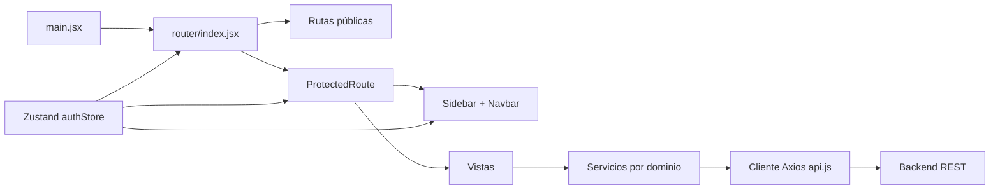

# Frontend Prográficos

Aplicación web interna para consultar y administrar el flujo de producción de Prográficos. El frontend ofrece autenticación por sesión, navegación protegida por roles y módulos iniciales de órdenes y usuarios.

> El proyecto está en desarrollo. Autenticación y administración de usuarios tienen implementación funcional; órdenes cuenta con listado y finalización, mientras varias opciones del menú todavía no tienen una ruta o vista implementada.

## Documentación del proyecto

- [Guía de desarrollo](./DEVELOPMENT_GUIDE.md): arquitectura, reglas, nomenclatura, seguridad, calidad y deuda técnica.
- [.env.example](./.env.example): referencia de configuración local. Algunas variables incluidas allí aún no son consumidas por el código.

## Tecnologías

| Área | Tecnología | Uso actual |
| --- | --- | --- |
| UI | React 19 | Componentes funcionales y hooks |
| Bundler | Vite 7 | Servidor local y compilación de producción |
| Navegación | React Router DOM 7 | Rutas públicas, privadas y protegidas por rol |
| Estado global | Zustand 5 | Usuario y estado de autenticación persistidos |
| HTTP | Axios 1 | Cliente centralizado con cookies e interceptores |
| Estilos | Tailwind CSS 4 | Utilidades, variables CSS y tema |
| Componentes base | shadcn + Base UI | Botones, inputs, tablas, diálogos y selects |
| Formularios | React Hook Form + Zod | Instalados; los formularios actuales todavía validan manualmente |
| Iconos y avisos | Lucide React + Sonner | Iconografía y notificaciones toast |
| Calidad | ESLint 9 | Reglas de JavaScript, hooks y Fast Refresh |
| Contenedor | Docker / Node 24 Alpine | Ejecución actual del servidor Vite en el puerto 5173 |

El código fuente está escrito en JavaScript con JSX. El alias `@` apunta a `src`.

## Requisitos

- Node.js 24 recomendado para coincidir con el `Dockerfile`.
- npm y acceso al backend de Prográficos.
- El backend debe aceptar credenciales CORS desde el origen del frontend, porque Axios usa `withCredentials: true`.

Las versiones verificadas durante el análisis fueron Node `24.13.1` y npm `11.8.0`.

## Puesta en marcha local

Ejecutar desde:

```text
C:\Users\juanp\Desktop\PROGRAFICOS\frontend-prograficos
```

En PowerShell:

```powershell
cd C:\Users\juanp\Desktop\PROGRAFICOS\frontend-prograficos
npm ci

if (-not (Test-Path .env)) {
  Copy-Item .env.example .env
}

npm run dev
```

La aplicación queda disponible normalmente en `http://localhost:5173`.

No se deben conservar paquetes instalados manualmente dentro de `node_modules`. `npm ci` reconstruye las dependencias a partir de `package-lock.json` y elimina paquetes extraños al manifiesto.

## Variables de entorno

| Variable | Consumida actualmente | Descripción |
| --- | --- | --- |
| `VITE_API_URL` | Sí | URL base del backend. Por defecto: `http://localhost:5001` |
| `ALLOWED_HOSTS` | Sí, en la configuración del servidor | Lista separada por comas para `server.allowedHosts`; debe existir en el entorno del proceso que inicia Vite |
| `VITE_SOCKET_URL` | No | Reservada en `.env.example`; no existe cliente Socket.IO en el código fuente actual |
| `VITE_SOCKET_PATH` | No | Reservada en `.env.example`; no existe cliente Socket.IO en el código fuente actual |
| `COOKIE_CROSS_SITE` | No | No se expone al cliente ni es leída por el frontend actual |
| `COOKIE_SECURE` | No | No se expone al cliente ni es leída por el frontend actual |

Reglas importantes:

- Solo las variables con prefijo `VITE_` se exponen al bundle del navegador.
- Nunca se deben guardar secretos, contraseñas, tokens o llaves privadas en variables `VITE_*`.
- `.env` debe ser local. El repositorio debe versionar únicamente `.env.example` con valores seguros de ejemplo.
- Si `ALLOWED_HOSTS` debe cargarse desde un archivo `.env` durante la evaluación de `vite.config.js`, la configuración tiene que usar `loadEnv`; actualmente se lee desde `process.env`.

## Scripts disponibles

| Comando | Propósito |
| --- | --- |
| `npm run dev` | Inicia Vite con recarga en caliente en el puerto 5173 |
| `npm run build` | Genera el bundle de producción en `dist` |
| `npm run lint` | Ejecuta ESLint sobre el repositorio |
| `npm run preview` | Sirve localmente el contenido compilado |

No hay todavía un framework ni un script de pruebas automatizadas.

## Arquitectura

La implementación actual sigue una arquitectura frontend por capas:



Flujo de una operación:

1. Una vista maneja interacción y estado de presentación.
2. La vista llama a un servicio del dominio.
3. El servicio usa la instancia Axios de `src/services/api.js`.
4. Axios envía cookies al backend y procesa globalmente respuestas `401` y `403`.
5. La vista actualiza su estado local y muestra el resultado con Sonner.

El estado de autenticación se guarda en el store `auth-storage` de `localStorage`. La autorización real debe seguir siendo responsabilidad del backend; ocultar un enlace o proteger una ruta en React solo mejora la experiencia de usuario.

## Estructura de carpetas

```text
frontend-prograficos/
├── public/                     # Archivos estáticos públicos
├── src/
│   ├── components/
│   │   ├── common/             # Componentes reutilizables del proyecto
│   │   ├── layout/             # Shell autenticado, navbar y sidebar
│   │   └── ui/                 # Primitivas generadas/adaptadas de shadcn
│   ├── lib/                    # Utilidades transversales, como cn()
│   ├── router/                 # Registro central de rutas y guards
│   ├── services/               # Cliente HTTP y servicios REST por dominio
│   ├── store/                  # Estado global Zustand
│   ├── views/                  # Pantallas organizadas por dominio
│   ├── index.css               # Tailwind, tema y tokens globales
│   └── main.jsx                # Punto de entrada de React
├── components.json             # Configuración de shadcn
├── eslint.config.js            # Reglas estáticas
├── jsconfig.json               # Alias y soporte del editor
├── vite.config.js              # Vite, Tailwind, alias y servidor
└── Dockerfile                  # Imagen actual de desarrollo/servidor Vite
```

`src/App.jsx`, `src/App.css`, `src/assets/react.svg` y `public/vite.svg` son remanentes del template y no participan en el árbol renderizado actual.

## Rutas registradas

| Ruta | Acceso | Estado/propósito |
| --- | --- | --- |
| `/` | Público | Redirige a `/login` |
| `/login` | Solo no autenticados | Inicio de sesión; un usuario autenticado va a `/dashboard` |
| `/dashboard` | Cualquier autenticado | Vista inicial, actualmente básica |
| `/ordenes` | `ADMIN`, `SUPERVISOR`, `EMPLOYEE` | Listado y finalización de órdenes |
| `/admin/usuarios` | `ADMIN`, `SUPERVISOR` | CRUD de usuarios mediante modales |
| `/admin/usuario/create` | `ADMIN`, `SUPERVISOR` | Redirige al listado; el alta se abre en modal |
| `/admin/usuario/:id/edit` | `ADMIN`, `SUPERVISOR` | Redirige al listado; la edición se abre en modal |
| `/unauthorized` | Público | Mensaje de acceso denegado |
| `*` | Público | Redirige a `/login` |

### Navegación todavía no implementada

El `Sidebar` muestra rutas que aún no existen en el router:

- `/admin/terceros`
- `/admin/productos`
- `/admin/troqueles`
- `/admin/medidad`
- `/admin/formatos`
- `/admin/tipos_de_papel`
- `/admin/procesos`

Además, las acciones de órdenes navegan a `/orders/create`, `/orders/:id` y `/orders/:id/edit`, pero ninguna de esas rutas está registrada y no siguen el nombre español `/ordenes`. Hasta que se implementen, el wildcard las enviará al login.

## Contrato REST consumido

Todas las llamadas parten de `VITE_API_URL` y envían cookies.

| Dominio | Método | Endpoint | Uso actual |
| --- | --- | --- | --- |
| Auth | `POST` | `/auth/login` | Iniciar sesión |
| Auth | `POST` | `/auth/logout` | Cerrar sesión |
| Auth | `GET` | `/auth/profile` | Servicio disponible, no invocado al arrancar |
| Auth | `POST` | `/auth/register` | Servicio disponible, sin vista pública |
| Usuarios | `GET` | `/users` | Listar |
| Usuarios | `GET` | `/users/:id` | Consultar para edición |
| Usuarios | `POST` | `/users/create` | Crear |
| Usuarios | `PUT` | `/users/update/:id` | Actualizar |
| Usuarios | `DELETE` | `/users/delete/:id` | Eliminar |
| Órdenes | `GET` | `/order` | Listar |
| Órdenes | `GET` | `/order/:id` | Servicio disponible |
| Órdenes | `POST` | `/order` | Servicio disponible |
| Órdenes | `PUT` | `/order/:id` | Servicio disponible |
| Órdenes | `DELETE` | `/order/:id` | Servicio disponible |
| Órdenes | `PATCH` | `/order/:id/finish` | Marcar como terminada |

Los campos como `surename`, `order_status`, `date_delivery_estimated` y `product_customer` reflejan el contrato actual del backend. No se deben “corregir” solo en la UI sin una migración coordinada del contrato.

## Autenticación y roles

Roles observados:

- `ADMIN`: acceso completo disponible y asignación de roles.
- `SUPERVISOR`: usuarios y órdenes; el formulario no permite cambiar roles.
- `EMPLOYEE`: dashboard y órdenes.
- `USER`: dashboard; aparece en la navegación y en el formulario de usuarios.

El flujo actual es:

1. `Login` envía credenciales a `/auth/login`.
2. La respuesta aporta `response.data.user`.
3. `authStore` persiste el usuario y `isAuthenticated`.
4. `ProtectedRoute` comprueba sesión y rol.
5. Un `401` limpia el store y redirige a `/login`; un `403` redirige a `/unauthorized`.

## Docker

Construcción y ejecución actuales:

```powershell
cd C:\Users\juanp\Desktop\PROGRAFICOS\frontend-prograficos
docker build -t frontend-prograficos .
docker run --rm -p 5173:5173 frontend-prograficos
```

La imagen actual ejecuta `npx vite` y usa `npm install`; es adecuada para desarrollo o validación, pero no es todavía una imagen de producción optimizada. La evolución recomendada es una compilación multietapa con `npm ci`, `npm run build` y un servidor estático/reverse proxy para `dist`.

## Estado de calidad verificado

| Verificación | Resultado actual |
| --- | --- |
| `npm run build` | Correcto; Vite advierte que el chunk JS principal mide aproximadamente 563 kB antes de gzip |
| `npm run lint` | Falla: 8 errores y 1 advertencia preexistentes |
| Pruebas automatizadas | No configuradas |

Los hallazgos y el orden recomendado de corrección están en [DEVELOPMENT_GUIDE.md](./DEVELOPMENT_GUIDE.md#deuda-técnica-priorizada).

## Flujo mínimo para contribuir

1. Leer [DEVELOPMENT_GUIDE.md](./DEVELOPMENT_GUIDE.md).
2. Crear una rama corta desde el estado acordado del repositorio.
3. Implementar la vista, su ruta, permisos, navegación y servicio como un solo cambio coherente.
4. Ejecutar `npm run lint` y `npm run build`.
5. Probar manualmente al menos los roles afectados, estados de carga, vacío, éxito y error.
6. Documentar cualquier variable, endpoint o decisión nueva.
